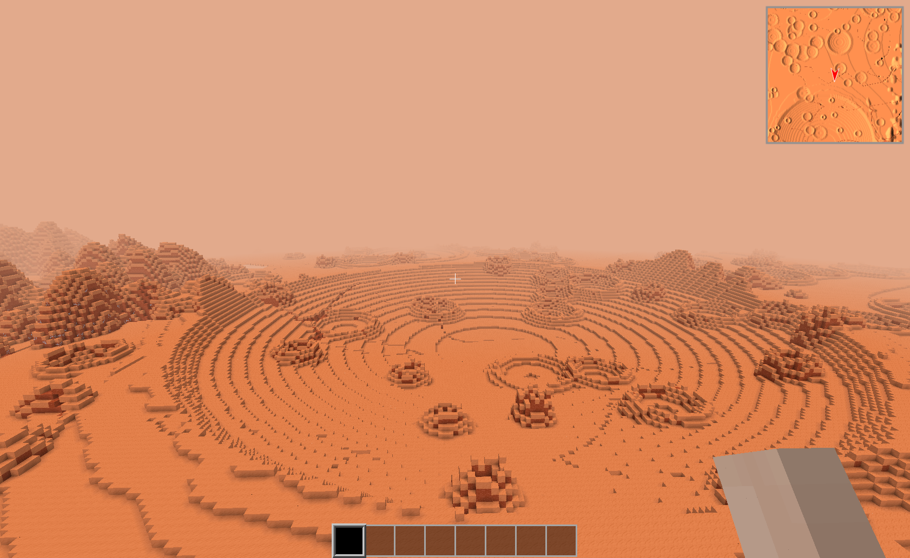

# CraterMG - Crater Map Generator for Minetest [EXPERIMENTAL]

Map generator with hills and craters. The idea is to create a map generator for space mintest games.

**Don't use this mod on any server!** It is in a very experimental stage of development.

**Version**: Proof of concept

**Dependancies**: default

**License**: LGPL v2.1

**See also**: [Minetest forum thread](https://forum.minetest.net/viewtopic.php?t=20840)

## Test it

To test Crater MG:
  * create a new world
  * select *minetest_game* game
  * choose *single node* map generator
  * enable *cratermg* mod

And explore lunar landcape !
